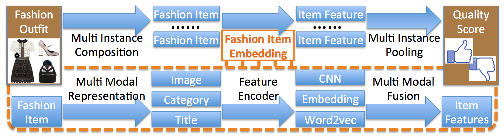

[x] problem formulation 
[x] algorithm 
[ ] comparison study 
[ ] evaluation 

A brief introduction:

> This work proposed a model for undertaking the outfit composition task.
> It treats an outfit as a set and builds a scorer to judge the outfit quality.
> It uses multi-modal data, including images, titles and categories of items.

# Problem formulation
Finding a compatible outfit is difficult because fashion style is subtle and subjective.
It would be convenient if a machine can help you make a stylish outfit composition.
This work was proposed to tackle the problem.

# Algorithm
Treating an outfit as a set, the proposed model applies a scoring mechanism to evaluate the popularity
of different outfits. It utilized multiple modalities of data, including images, titles and categories.
Data of different modalities can provide information of various dimensions to the model.

The data used in the algorithm was downloaded from __polyvore.com__. But this website has been closed permanently.

Network structure of the proposed model is shown below:

The proposed model first used a simplified AlexNet to extract features from images for each item in an outfit.
Then, it combines multiple features into one feature to represent the outfit, and predicts its quality score
according to its popularity. Two points lie in the proposed model:
- Feature combination approach
- Quality evaluation approach
We are going to introduce them briefly in the following.

## Feature combination
As the number of items in an outfit is various, it is important to find a way to combine features.
After obtaining image features for items, the paper tried three different approaches to combine them.
- Elementwise average pooling
- Elementwise max pooling
- Recurrent neural net
Experiments show that elementwise average pooling achieved the best results.

## Quality evaluation
What is a good outfit? It is not an easy question to answer. But we might be able to obtain some related
information by using user data. The proposed model views outfits with many likes as popular outfits, and those
with few likes as unpopular outfits. The quality evaluation problem thus becomes a 0-1 classification problem.

# Comparison study

