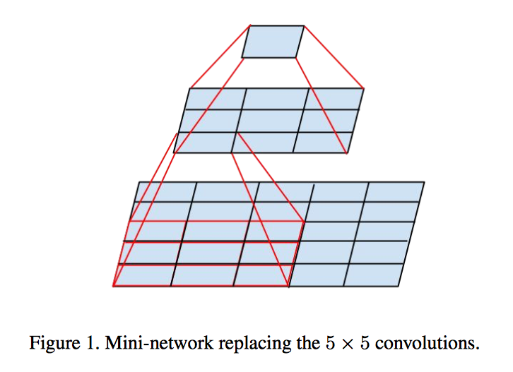
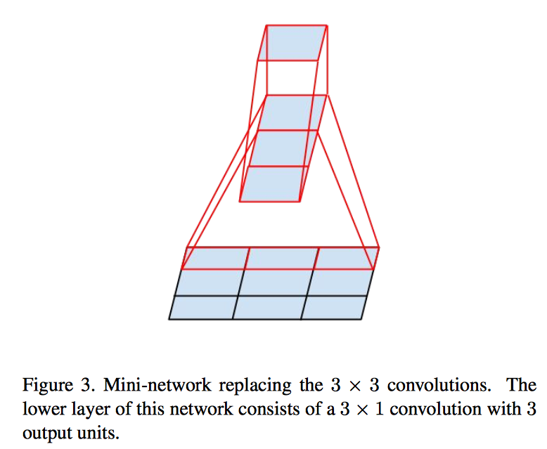
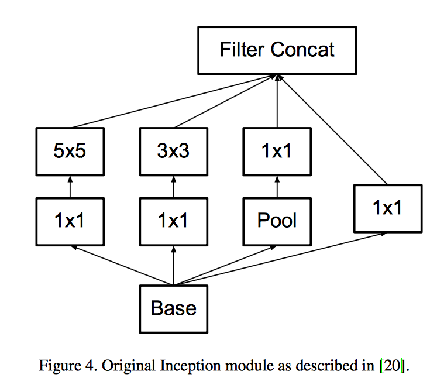
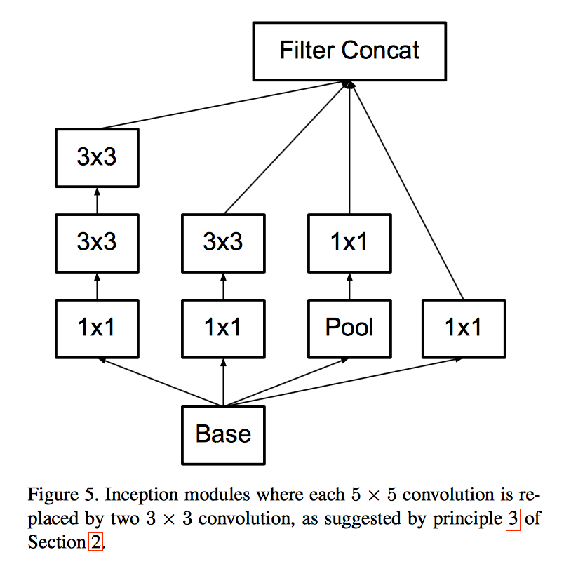
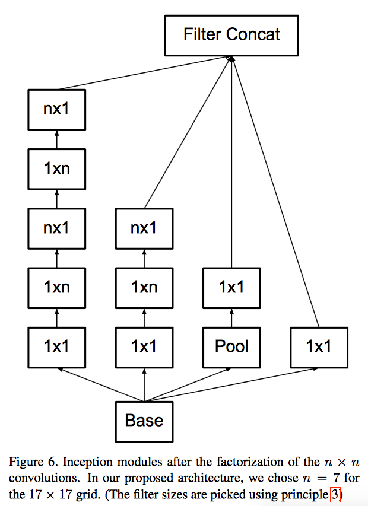
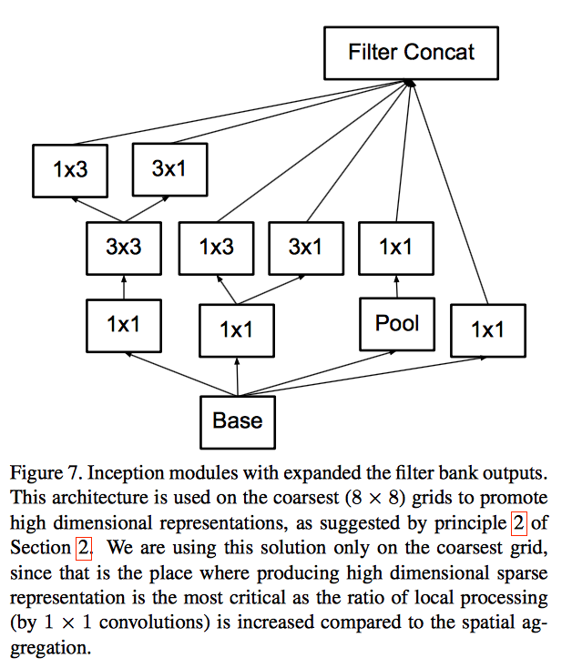
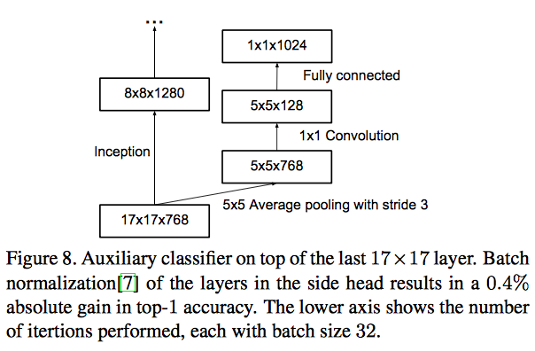
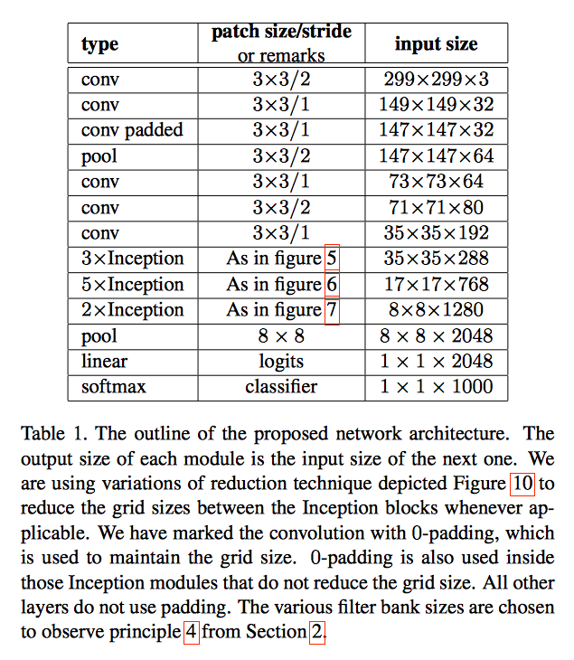
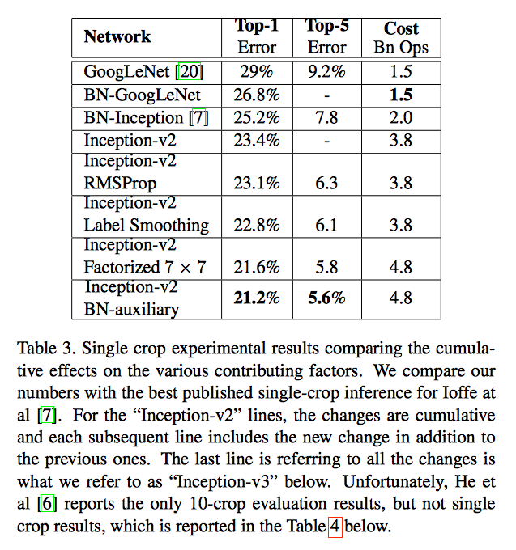

A brief introduction:

> This is the version 3 of the inception model proposed by google
> to tackle image classification tasks.
> Inception modules were updated and several tips for building a deep network were proposed.
> I just have no idea why people doing fashion related work love this model so much.

# Problem formulation
Mainly solve the image classification task. But hopefully can transfer the model or the learned features for other tasks.

# Algorithm
The paper introduced several new inception modules to reduce the number of parameters and training time, but improve the quality of the captured features.

They list several __general design principles__:
1. avoid representational bottlenecks, which means that the dimensionality of the volume should be better increased every tile.
2. increase the activations per tile.
3. spatial aggregation.
4. balance the width and depth of the network.

> Actually, I don't quite understand the 3 and 4 points mentioned above.

The propose to factorize convolutions with large filter size:
## factorize into smaller convolutions

> But what actually bothers me is that they don't use this structure in their codes.

## factorize into asymmetric convolutions

## four different inception modules
1. the original one

2. the modified one from 1

3. another one using asymmetric convolution

4. the one suggested by principle 2

> **Note**: the above modules should be used under different circumstances, as mentioned by the texts below images.

## Use auxiliary classifiers

They claimed that using an auxiliary classifier in higher level can be regarded as a regularizer to improve the classification results.

## The inception v2 model

## The inception v3 model

The main difference between v2 and v3 is in the training procedure instead of network structure.
I did not mention label smoothing here. It is like adding some random noise to the labels to prevent overfitting.
